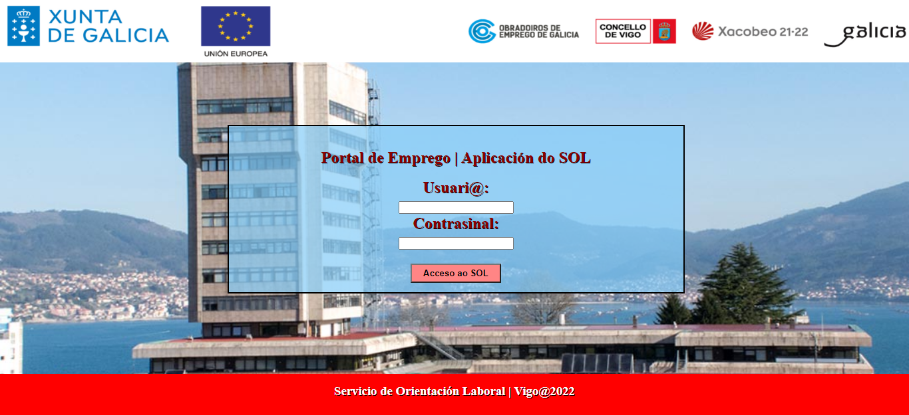
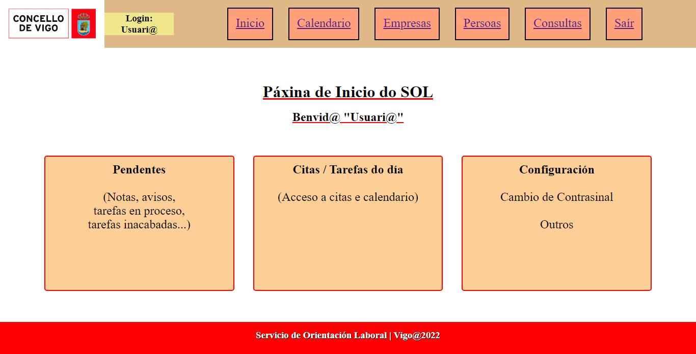
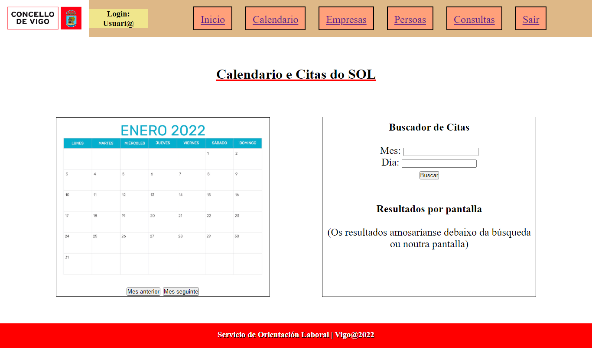
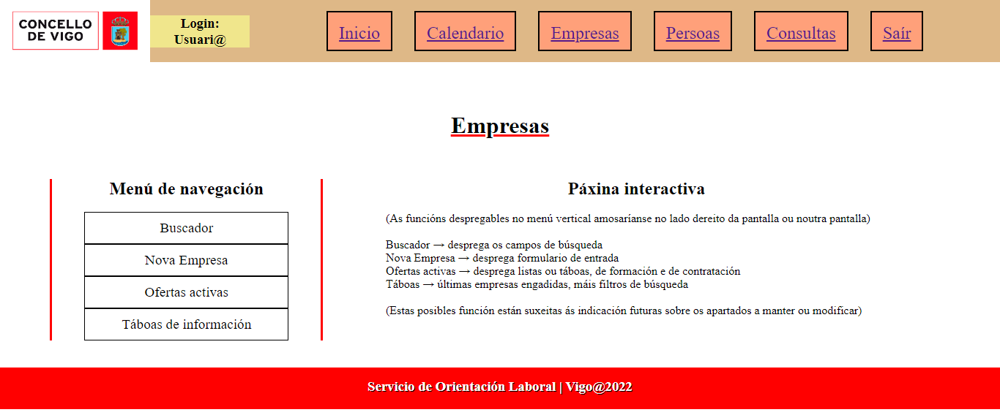
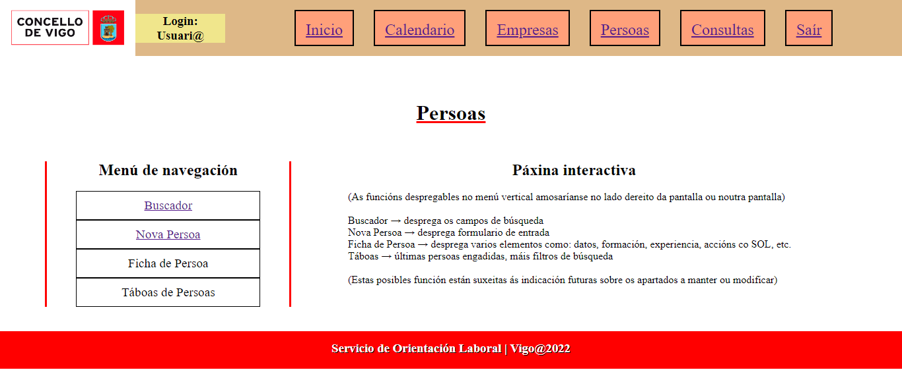
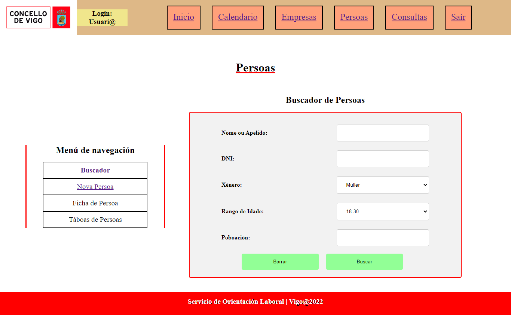
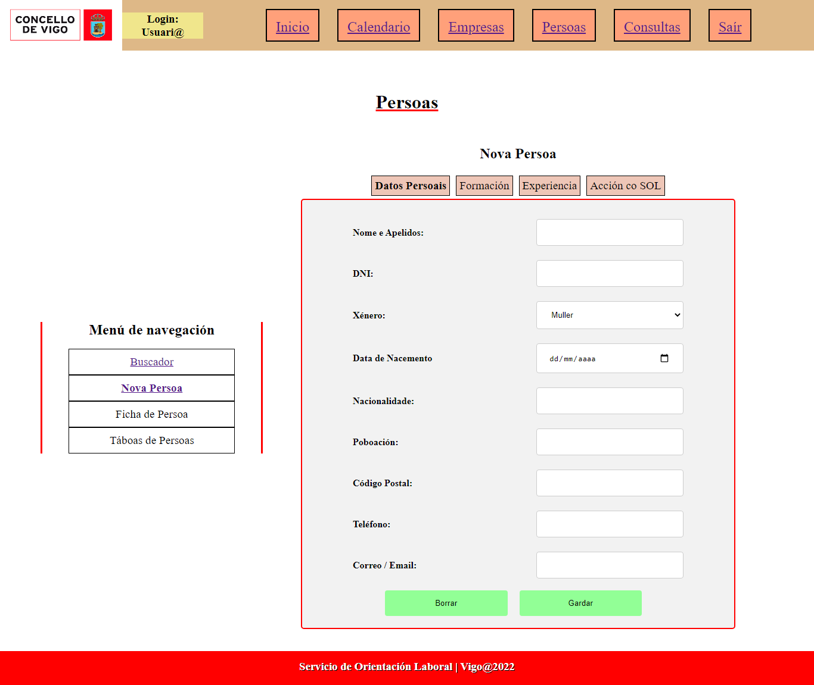
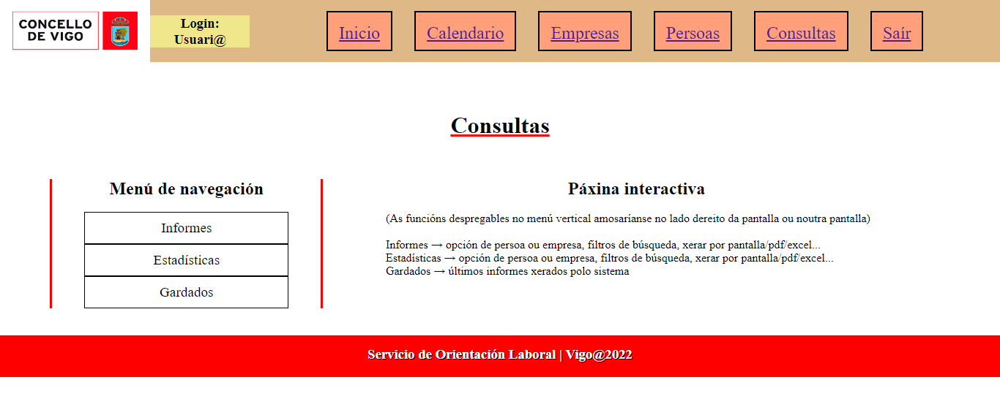
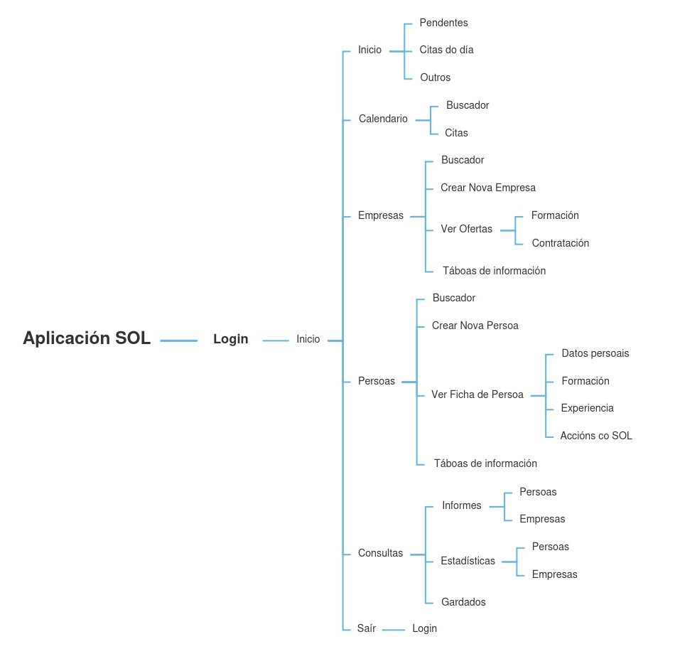

# Ejercicio de Maqueta y Diagrama de la aplicación del SOL

Tras la reunión informativa con el cliente se ha hecho una reestructuración de la aplicación, sobre el informe preliminar y los wireframes iniciales, y se ha realizado una maqueta en html y css de lo que serían las vistas de las páginas que conforman la web. Caben destacar varios puntos:

- Esta maqueta inicial es una mera aproximación a un posible diseño del cual rescatar ciertas ideas o elementos tras una puesta en común con las otras propuestas.
- Al realizarse exclusivamente con html y css se ha optado por elaborar un código sencillo desde cero, en vez del uso de librerías de estilos u otros.
- Por otra parte, tampoco se ha hecho uso de componentes para los elementos más repetidos (como pueden ser los header y footer de las páginas), optando por declarar el código en cada uno de los archivos para una mejor visualización global al modificar las páginas individuales.
- Todas las páginas html están enlazadas mediante links internos para una mejor muestra de la funcionalidad que tendría la aplicación completa, siendo posible navegar de una página a otra con un solo click. "Saír", de momento, devuelve al usuario a la página de login, pero lo indicado sería que apareciera un cuadro previo en la pantalla que pidiera confirmación de salida.
- Este proyecto-maqueta no consta de lenguaje de guión, por lo que las páginas estáticas muestran contenido que sería variable en una aplicación terminada según las funciones que se insertarían en ella (más links internos, apertura de otras páginas o subapartados, menús con diversas funciones, etc.).
- Por ejemplo, en los apartados de "Persoas" y "Consultas" hay una opción de abrir un "Buscador" que generaría un Resultado; con este a su vez se podría acceder a una "Ficha" concreta y dentro de ella se encontrarían las opciones de ver información, modificar o eliminar datos, etc.

En las siguientes imágenes se muestra la maquetación inicial y orientativa de la aplicación:

**Pantalla de Login:**

**Pantalla de inicio:**

**Pantalla de Calendario:**

**Pantalla de Empresas:**

**Pantallas de Personas:**

**Pantalla de Cosultas:**

Asimismo, también se ha realizado un **diagrama** visual de la organización de páginas y entradas que compondrían la aplicación, a modo de esquema, reflejado en la siguiente imagen:

Por último, se ha creado un repositorio en Github con el proyecto para su envío y documentación, también con el propósito de realizar la puesta en común de las propuestas.
